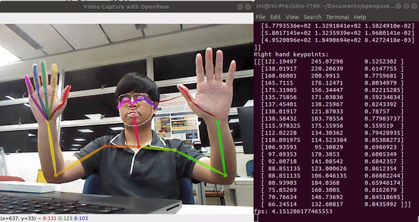

# Openpose_Cam with Python
OpenPose is one of the first real-time pose estimation software to detect human body posture, hand, facial, and foot keypoints. It can detect more than one person within an image. The software is built largely based on Caffe framework and OpenCV computer vision software.
Below is the demonstration on how the Openpose works. Quadro RTX 5000 graphic card is used in this demo. 

<p align="center"></p>

## Recommended Setup 
* OS: Ubuntu 18.04 
* Nvidia Driver version: 460.56
* CUDA version: 10.1
* CuDNN version: 7.6.5

For more information on the Ubuntu Prerequisites, here is the [link](https://github.com/CMU-Perceptual-Computing-Lab/openpose/blob/master/doc/installation/1_prerequisites.md) for references.  

## Installation

Please check out the [blog]() for more information on the installation steps.

Then, in your terminal, git clone this repo using the below command:

```
git clone https://github.com/tyseng92/Openpose_Cam
```

Remember to replace the model folder with the folder in this [link](https://drive.google.com/drive/folders/14kfPgMH9M4oo1tg33tKSwrOA4uB0m_19).

## Run the code

To use the real time pose estimation on webcam, in terminal run the command below:
```bash
# Detect only human body posture
python3 openpose_cam.py 

# Detect human body posture with hand and face.
python3 openpose_cam.py --face True --hand True
```


## Reference
[1] https://github.com/CMU-Perceptual-Computing-Lab/openpose/blob/master/doc/03_python_api.md

[2] https://medium.com/@erica.z.zheng/installing-openpose-on-ubuntu-18-04-cuda-10-ebb371cf3442

[3] https://medium.com/pixel-wise/real-time-pose-estimation-in-webcam-using-openpose-python-2-3-opencv-91af0372c31c


 
